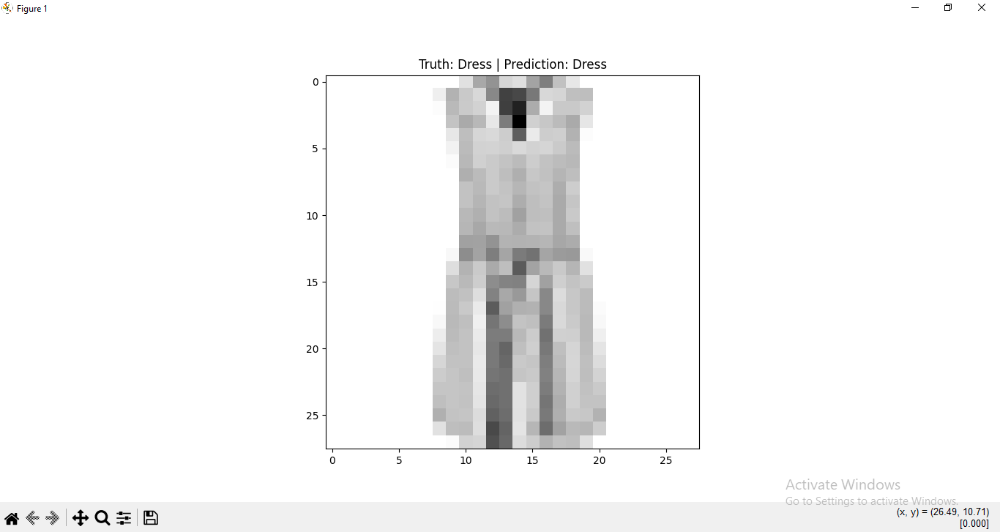

# My-First-Deep-Learning-Project
My first AI models using TensorFlow

# 🧠 My First Deep Learning Projects

Welcome to my AI portfolio! 👋
This repository contains my first steps into the world of **Deep Learning** and **Computer Vision** using Python and TensorFlow.

Here, I document my journey of building Neural Networks from scratch, training them, and evaluating their performance.

---

## 📂 Projects Overview

### 1️⃣ Temperature Converter 🌡️
**File:** `celsius_to_fahrenheit.py`

A simple Neural Network designed to discover the physical relationship between Celsius and Fahrenheit.
* **Concept:** Single-Neuron Regression.
* **Goal:** The model learns the formula `F = C * 1.8 + 32` without being explicitly programmed with it.
* **Result:** Successfully predicted the conversion with high accuracy after training for 500 epochs.

### 2️⃣ Fashion MNIST Classifier 👕👟
**File:** `fashion_vision.py`

A Computer Vision model capable of classifying articles of clothing into 10 distinct categories (T-shirts, Sneakers, Coats, etc.).
* **Dataset:** Fashion MNIST (70,000 grayscale images).
* **Architecture:** Deep Neural Network (Flatten -> Dense 128 (ReLU) -> Dense 10 (Softmax)).
* **Performance:** Achieved **~89% accuracy** on unseen test data.

#### 📊 Visualizations
Here is how the model performs on real data:

| Training Accuracy Curve | Model Prediction Sample |
|:-----------------------:|:-----------------------:|
|  |  |
*(The model correctly identifies a Coat vs. a Dress)*

---

## 🛠️ Technologies Used
* **Language:** Python 🐍
* **Framework:** TensorFlow & Keras 🤖
* **Visualization:** Matplotlib 📈
* **Data Processing:** NumPy 🔢

---

## 🚀 How to Run
1.  Clone the repository:
    ```bash
    git clone [https://github.com/YourUsername/My-First-Deep-Learning-Projects.git](https://github.com/YourUsername/My-First-Deep-Learning-Projects.git)
    ```
2.  Install dependencies:
    ```bash
    pip install tensorflow numpy matplotlib
    ```
3.  Run the scripts:
    ```bash
    python fashion_vision.py
    ```

---

*Created with ❤️ by Karim.*
